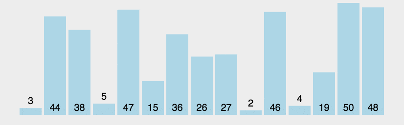

# 简单算法

## 1 [排序算法](Sorting)

- 1.1 [冒泡排序：BubbleSort](Sorting/BubbleSort.py)  
    
  每轮迭代从左往右依次比较相邻两个数的大小，将较大的数往右边移动，直到没有可移动的数时，开始迭代下一轮；重复n-1轮，依次将未排序序列中最大的数移动到序列右边。
- 1.2 [插入排序：InsertSort](Sorting/InsertSort.py)  
    
  从第二个元素开始迭代，该元素依次与前面已排序的元素比较大小(从大到小比较)，将其插入到比前一个元素大比后一个元素小的位置
- 1.3 [选择排序：SelectSort](Sorting/SelectSort.py)  
    
  每轮迭代都在未排序的序列中选出最小值并添加到排序后的序列后，直到迭代完n-1个元素(最后一轮只剩一个元素)
- 1.4 [希尔排序：ShellSort](Sorting/ShellSort.py)  
  

## 2 [质数](prime_number.py)  

