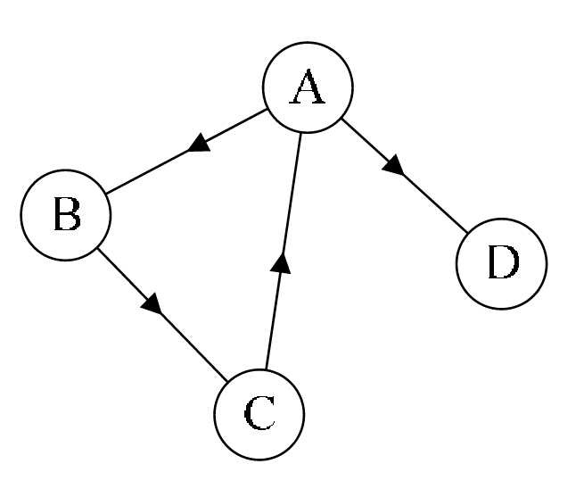
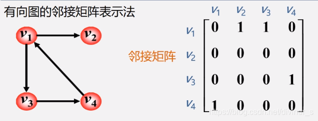

# PageRank

## 1 有向图

### 1.1 相关概念

- 出度：某个定点指出的边的个数
- 入度：某个定点被指向的边的个数
- 度：出度 + 入度
- 有向边：一个定点指向另一个定点的边，指出位置为头，指入位置为尾
- 有向图：一条至少含有一条边，且起点和终点都相等的有向路径

### 1.2 邻接矩阵

定义：图G=(V,E),其中顶点集V=v1,v2,…,vn，边集 E=e1,e2,…,eε。用aij表示顶点vi与顶点vj之间的边数，可能取值为0,1,2,…，称所得矩阵A(
G)为图G的邻接矩阵。

有向图中

- 列表示：Vi来自于其他顶点的入度边数
- 行表示：Vi来指向其他顶点的出度边数

## 1.3 相关Python库

- scikit-network: https://scikit-network.readthedocs.io/en/latest/first_steps.html#installation
- networkx: https://networkx.org/documentation/stable/tutorial.html
- igraph: https://python.igraph.org/en/stable/