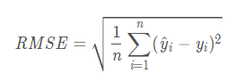

# 统计分析基础概念
## 1 误差
### MSE（均方误差）
https://en.wikipedia.org/wiki/Mean_squared_error    
  
注：预测值与实际值之差的平方的均值

### RMSE （均方根误差）
root-mean-square error(RMSE)   
root-mean-square deviation(RMSD)   
https://en.wikipedia.org/wiki/Root-mean-square_deviation    
     
 

### MAE （平均绝对误差）
Mean absolute error     
https://en.wikipedia.org/wiki/Mean_absolute_error     
  
注：预测值与实际值之差的绝对值的均值

### MASE （平均绝对尺度误差）
mean absolute scaled error  
https://en.wikipedia.org/wiki/Mean_absolute_scaled_error    
     
注：ej为实际值与预测值之差;Y为实际值

### MAPE （平均绝对百分比误差）
Mean absolute percentage error  
https://en.wikipedia.org/wiki/Mean_absolute_scaled_error    
     

### SSE (RSS|SS_Res,误差平方和|残差平方和)
sum of squares due to error 
https://en.wikipedia.org/wiki/Explained_sum_of_squares  
    
注：预测值与实际值之差的平方和

### SSR (ESS|SS_Reg,回归平方和)
sum of squares due to regression 
explained sum of squares
https://en.wikipedia.org/wiki/Residual_sum_of_squares   
     
注：预测值与实际值均值之差的平方和

### SST (SS_tot,总偏差平方和)
Total sum of squares    
https://en.wikipedia.org/wiki/Total_sum_of_squares  
     
注：实际值与实际值均值之差的平方和

### RSquared (可决系数)
Coefficient of determination    
https://en.wikipedia.org/wiki/Coefficient_of_determination#Adjusted_R2  
     

### Adjusted RSquared (调整可决系数)
adjusted coefficient of determination   
https://en.wikipedia.org/wiki/Coefficient_of_determination#Adjusted_R2  
  
注：n为样本数；p为特征数