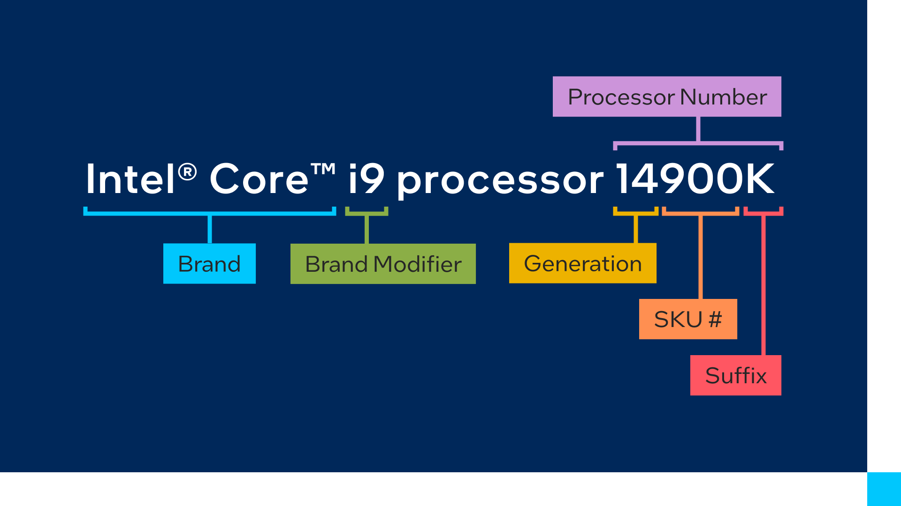
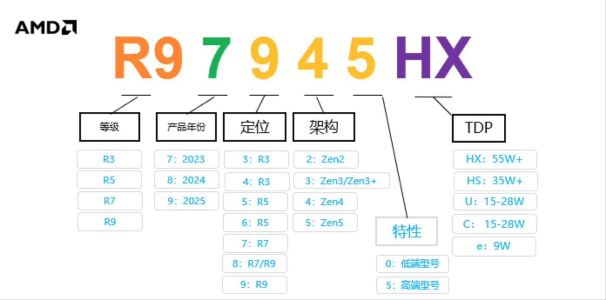
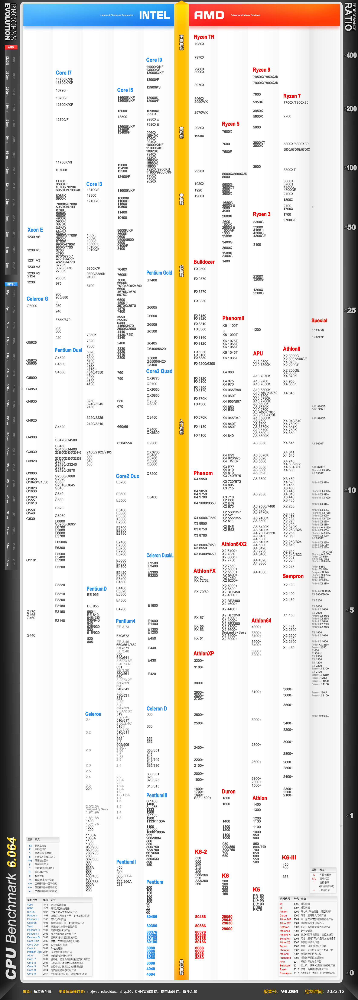

# 显卡
## 常见品牌
### 英特尔
芯片命名规则：

- Brand Modifier : 芯片级别
- Generation：芯片代数
- SKU：库存管理的标识数
- Suffix：后缀

| 分级   | 品牌                  | 其他 |
|:-----|:--------------------|:---|
| i3 | 入门级            |    |
| i5 | 中级 |    |
| i7 | 中高级     |    |
| i9 | 高级    |    |

| 设备类型   | 后缀                  | 定位 |
|:-----|:--------------------|:---|
|台式机|K|高性能，未锁频，可超频|
| |X|最高性能版，未锁频，可超频|
| |Φ|需要独立显卡|
| |S|特别版|
| |T|功耗优化|
|移动端|HK|高性能，所有SKU未锁频|
| |HX|最高性能，所有SKU未锁频|
| |H|移动端标准电压版|
| |P|轻薄本性能优化版|
| |U|低功耗，高能效版|
| |Y|极低功耗版|
| |G1-G7|显卡级别|

### AMD
芯片命名规则：

### CPU天阶图
注：参考秋刀鱼半藏

